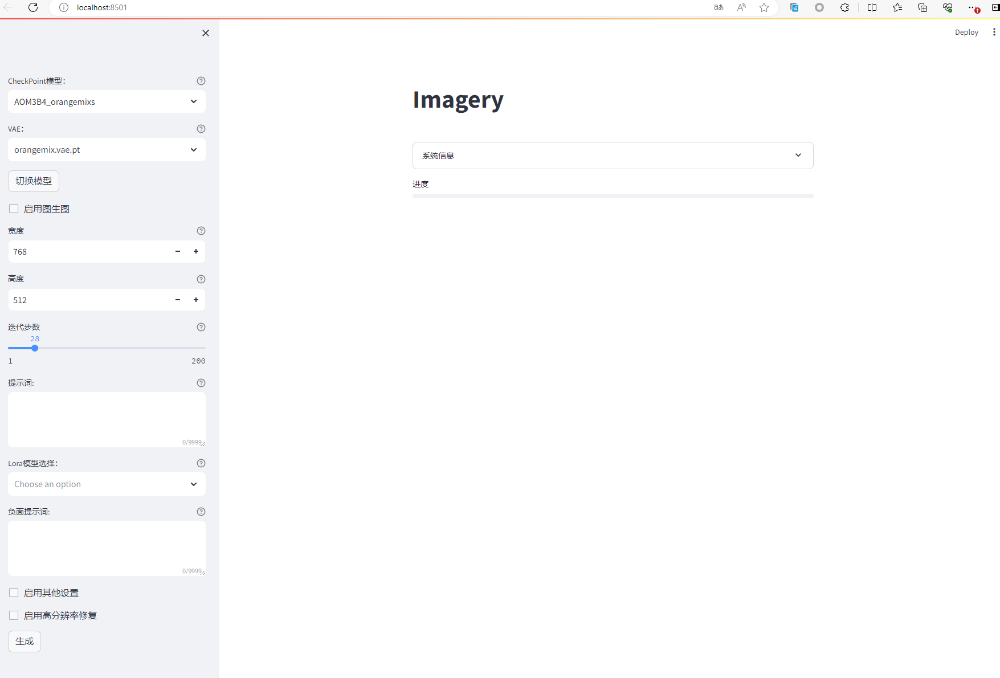

## Imagery

基于Stable Diffusion WebUI API的第三方WebUI，目的在于将SDWebUI服务器作为后端，而UI交互界面则交由另一台服务器实现。

### 安装
1、部署并启动Stable Diffusion WebUI，并参照[官方wiki](https://github.com/AUTOMATIC1111/stable-diffusion-webui/wiki/Command-Line-Arguments-and-Settings)加入 ```--api``` 启动参数。

2、安装Python。 

3、安装依赖环境。 

```pip install -r requirements.txt``` 

4、修改配置文件中的API地址。 

```nano config.json``` 
```{
    "StableDifusionWebuiAPIURL": "http://127.0.0.1:7860",
    ^ SD WEBUI 地址
    "Step": 28,
    ^ 默认采样步数
    "W": 768,
    ^ 默认图片宽度
    "H": 512,
    ^ 默认图片高度
    "SEED": -1,
    ^ 默认随机种子
    "Ngtloraselected": [],
    ^ 默认加入的负面LoRa
    "Embselected": [],
    ^ 默认加入的文本转义（embedding）
    "NGTEmbselected": [],
    ^ 默认加入的负面文本转义（embedding）
    "hi_enable": false,
    ^ 默认开启高清修复
    "hr_scale": 1.00,
    ^ 高清修复倍率
    "hr_upscaler": "Latent",
    ^ 高清修复采样器
    "sample_meth": "DPM++ 2M Karras",
    ^ 采样方式
    "hr_second_pass_steps": 0,
    ^ 高清修复步数
    "seed": -1,
    ^ 默认随机种子
    "cfg": 7,
    ^ 默认提示词相关性
    "disnoise": 0.7
    ^ 默认重绘幅度
}
```

5、运行Imagery

```streamlit run web.py```

